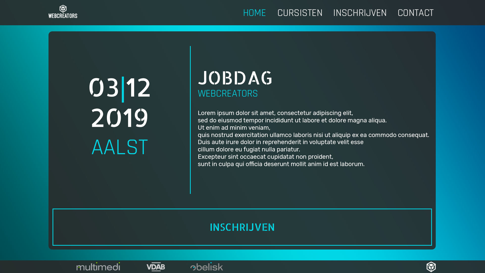

# jobdagAalst
deadline 25/10

| index | cursisten | inschrijving | contact |
|-------|-----------|--------------|---------|
| welcomeHeader | | | |
| nav | nav | nav | nav |
| | grid cards | form | form    |
| about/aboutUs |   |     |     |
| footer | footer | footer |  footer |



bg:
```css
body {
height: 100%;
min-height: 100vh;
background-image: linear-gradient(to top right, rgba(0,76,82,1), rgba(0,215,230,1), rgba(0,70,123,1));
}       
```
text:
```css
menu = Rajdhani | datum, jobdag, knop = Allerta Stencil | text = Rubik  
```
html:
```html
<link href=”https://fonts.googleapis.com/css?family=Allerta+Stencil|Rajdhani|Rubik&display=swap” rel=”stylesheet”>  
```
css:
```css
font-family: ‘Rajdhani’, sans-serif;
font-family: ‘Allerta Stencil’, sans-serif;
font-family: ‘Rubik’, sans-serif;  
```
colors:
```css
#292929 
#00d7e6 
#ffffff  
rgb(41, 41, 41);
rgb(0, 215, 230);
rgb(41, 41, 41);
```
header, footer:
css:
```css
background: rgba(41, 41, 41, 0.9);  
```
container:
css:
```css
border-radius: 15px;
background: rgba(41, 41, 41, 0.9);  
